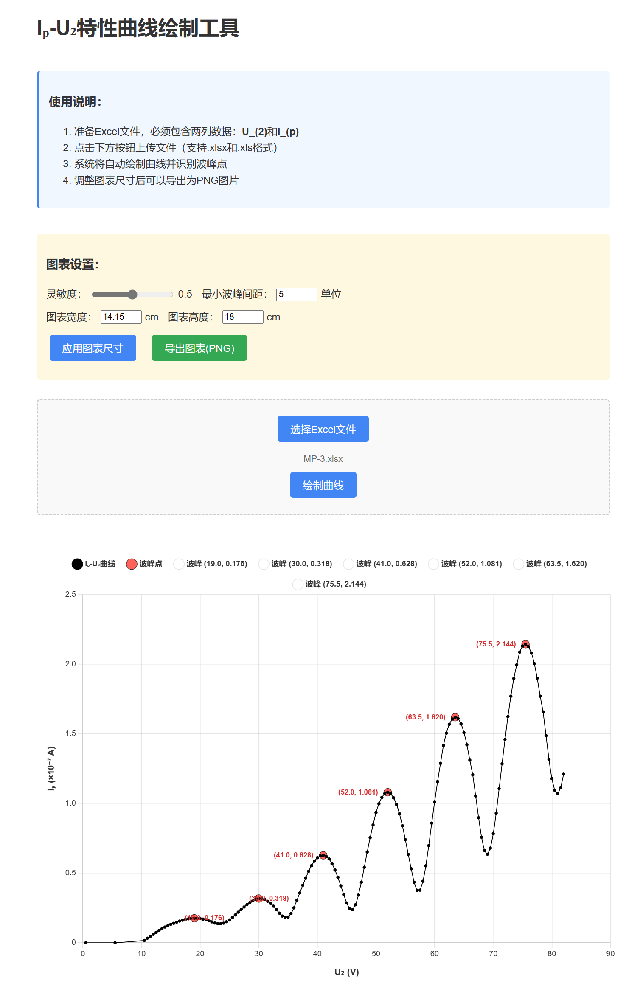

# Iₚ-U₂特性曲线绘制工具

##  项目简介

一个基于Web的Iₚ-U₂特性曲线分析工具，可自动识别Excel数据中的波峰点，支持自定义图表尺寸和导出高清PNG图片。



##  使用方法

### 1. 数据准备

准备Excel文件，必须包含两列数据：（按照如下格式给两列命名）

- `U_(2)`
- `I_(p)` 

### 2. 上传数据

1. 点击"选择Excel文件"按钮上传文件
2. 点击"绘制曲线"按钮生成图表

### 3. 参数设置

- **灵敏度**：调节波峰检测的敏感度（0.1-0.9）（如果发现部分波峰没有正确识别就调节检测灵敏度）
- **最小波峰间距**：设置波峰之间的最小距离
- **图表尺寸**：自定义图表的宽度和高度（厘米单位）（调节比例使得图线协调）

### 4. 导出图表

点击"导出图表(PNG)"按钮保存高清图片

## 技术细节

- **前端框架**：纯HTML/CSS/JavaScript
- **图表库**：Chart.js + chartjs-plugin-datalabels
- **Excel解析**：SheetJS (xlsx)
- **图片导出**：Canvas API

##  样式定制

如需修改数据点大小，可编辑以下参数：

```javascript
// 普通数据点大小
pointRadius: 2  // 默认2（可调小至1或调大至5）

// 波峰点大小 
pointRadius: 4  // 默认4（可调小至2或调大至8）
```

## 许可证

MIT License

##  使用建议

1. 对于密集数据，建议调高灵敏度
2. 导出图片前可先调整合适的图表尺寸

## 在线访问

本项目已部署到yourware.so,访问链接https://bzrbalw29d.app.yourware.so/ 即可使用。(目前访问需要代理)
